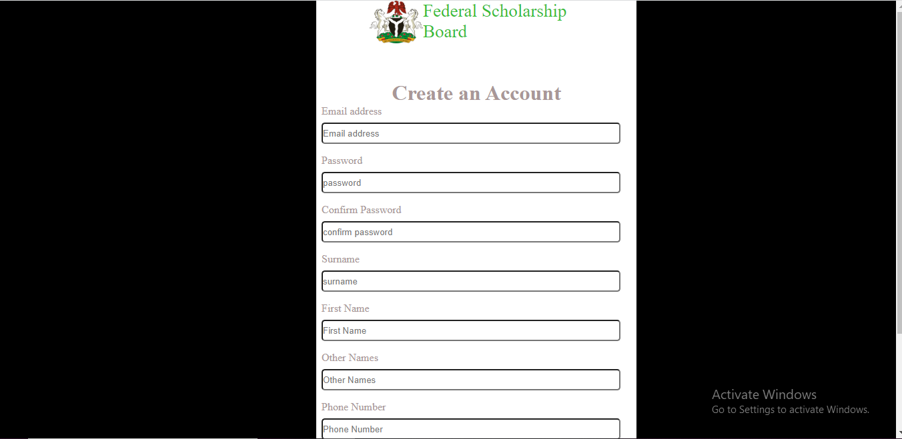

# scholarship
*An implementation of scholarship clone with html and css*
## Prequisite
- Your browser version should be up to date for better experience
## Getting Started
Clone or download this repository and run with a local server of open `index.html` with your favorite browser
## Features
- Home page
- Registration form
## Tech/framework used
- Html
- Css
## Preview here
[Demo](https://rawcdn.githack.com/Intelligence247/scholarship/924cfcaf6a5c17ccccda53da2cd4b90ebc439ff8/index.html)

## Contact
If you want to contact me you can reach me at
- https://github.com/Intelligence247 or
- uthmanabdullahi2020@gmail.com
## Addtional Info
- This is one of the series of project for the @CodeVillage.org
- This is not meant for production. It's for learning purpose only
